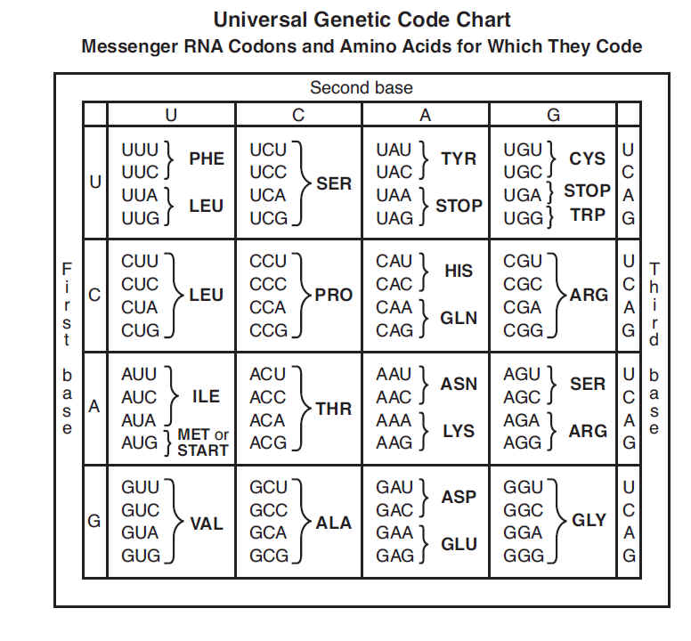

# HackISU2015
Iowa State University Hackthon 2015

## Project
This project converts protein sequences to a compact RNA representation as well as converting back to protein sequences.

Source: [http://mrsebiology75.weebly.com/uploads/5/1/4/8/5148626/9698672_orig.jpg](http://mrsebiology75.weebly.com/uploads/5/1/4/8/5148626/9698672_orig.jpg)